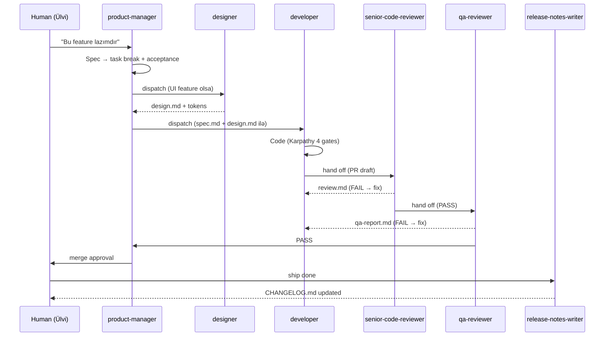

# AGENTS.md — Roles, Handoff Protocol, Operating Workflow

> Bu sənəd AI agent-lərə deyir: **kim hansı işi görür, kimə nə verir, nə vaxt nə yoxlayır.**
> Hybrid setup: lokal Claude Code (PM, reviewer, QA) + remote agent platform (backend, frontend developers).

---

## 1. Komanda strukturu

```
                  ┌─────────────────┐
                  │  Ülvi (human)   │  ← escalation only
                  └────────┬────────┘
                           │
                  ┌────────▼────────┐
                  │ product-manager │  ← LEAD agent
                  └────┬─────────┬──┘
            ┌──────────┴──┐   ┌──┴──────────┐
            │             │   │             │
        ┌───▼───┐   ┌─────▼─┐ │  ┌──────────▼──────┐
        │designer│   │backend│ │  │ frontend-mobile  │
        └───┬───┘   └───┬───┘ │  └──────────┬──────┘
            │           │     │             │
            │           │     │  ┌──────────▼──────┐
            │           │     │  │  frontend-web   │
            │           │     │  └──────────┬──────┘
            │           │     │             │
            └───┬───────┴─────┴─────────────┘
                │
        ┌───────▼───────────┐
        │senior-code-reviewer│
        └───────┬───────────┘
                │
        ┌───────▼─────┐
        │ qa-reviewer │
        └───────┬─────┘
                │
        ┌───────▼──────────────┐
        │release-notes-writer  │
        └──────────────────────┘
```

---

## 2. Rollar — kim nə edir

### 2.1 `product-manager` (LEAD)

**Çağırış:** Hər yeni feedback / feature ideyası / spec sual ilə BAŞLAYIR. Heç bir agent PM-siz işə başlamır.

**Məsuliyyət:**
- Spec-i oxuyub task-a parçalamaq
- Acceptance criteria yazmaq
- Designer / developer / QA-ya dispatch
- Scope creep-dən qorumaq (PRD anti-goals ilə)
- Pilot success metric-lərinə uyğunluğu izləmək
- Conflict resolution

**Output:** `team-chat/<task-id>/spec.md`

### 2.2 `designer`

**Çağırış:** PM dispatch edəndə, UI feature-i olduqda.

**Məsuliyyət:**
- HTML/JSX prototype-larından design token + ölçü çıxarmaq
- AZ string-lərini i18n key-lərə map etmək
- Edge case (empty state, error, loading) tasarımı
- Accessibility (kontrast, font size, touch target)

**Output:** `team-chat/<task-id>/design.md` + Figma/HTML referans linki

### 2.3 `backend-developer`

**Çağırış:** PM dispatch edəndə, backend dəyişiklik tələb olunduqda.

**Məsuliyyət:**
- Supabase migration (DDL + RLS policy)
- Edge function (Deno)
- pgTAP RLS test
- `packages/domain` saf TS logic
- Type generation (`supabase gen types`)

**Apply Karpathy 4 gates** (oxu, minimum, test, clean).

**Output:** PR + `team-chat/<task-id>/progress.md` (incremental)

### 2.4 `frontend-mobile` (Expo)

**Çağırış:** PM dispatch edəndə, mobile screen tələb olunduqda.

**Məsuliyyət:**
- Expo screen + expo-router setup
- NativeWind styling (tokens-dan)
- TanStack Query + Supabase realtime client
- Native module integration (location, wifi, notifications)

**Apply Karpathy 4 gates.**

**Output:** PR + `team-chat/<task-id>/progress.md`

### 2.5 `frontend-web` (Next.js)

**Çağırış:** PM dispatch edəndə, web dashboard tələb olunduqda.

**Məsuliyyət:**
- Next.js App Router səhifə + layout
- shadcn/ui + Tailwind v4
- Server Component default, Client Component səbəblə
- Realtime channel subscription

**Apply Karpathy 4 gates.**

**Output:** PR + `team-chat/<task-id>/progress.md`

### 2.6 `senior-code-reviewer`

**Çağırış:** Hər non-trivial PR commit-dən ƏVVƏL.

**Məsuliyyət:**
- Diff-i oxumaq, junior səhvləri tapmaq
- Hidden assumption, hoist/late-binding
- Async race condition
- CSS layout trap
- DOM lifecycle bug
- Missing cleanup
- Scope creep
- Adjacent-code drive-by

**Output:** `team-chat/<task-id>/review.md` (PASS / FAIL + suallar)

### 2.7 `qa-reviewer`

**Çağırış:** Reviewer PASS verdikdən SONRA, merge-dən ƏVVƏL.

**Məsuliyyət:**
- Spec-ə uyğunluq
- E2E flow yoxlama
- Edge case (offline, network fail, GPS off)
- Visual QA (screenshot diff)
- Accessibility check
- AZ language consistency

**Output:** `team-chat/<task-id>/qa-report.md` (PASS / FAIL + bug list)

### 2.8 `release-notes-writer`

**Çağırış:** Hər ship-li versiya bitəndə, AZ-da changelog üçün.

**Məsuliyyət:**
- `CHANGELOG.md`-ə **AZ dilində** kümülativ entry
- User-facing dil — texniki termin minimum
- Version + date + bullet list of features

**Output:** `CHANGELOG.md` update

---

## 3. Handoff workflow (ümumi axın)



---

## 4. team-chat/ qovluğu

Hər task üçün ayrıca qovluq:
```
team-chat/
└── 2026-05-12-CI-1-morning-gate/
    ├── spec.md           ← PM yazır
    ├── design.md         ← Designer yazır (varsa UI)
    ├── progress.md       ← Developer (incremental update)
    ├── review.md         ← Senior reviewer
    ├── qa-report.md      ← QA reviewer
    └── closeout.md       ← PM (task bitəndə)
```

Naming: `YYYY-MM-DD-<screen-id>-<short-name>`

[team-chat/README.md](./team-chat/README.md) — fayl şablonları + nümunə

---

## 5. Karpathy 4 gates (kod yazan agent-lər üçün)

Hər commit-dən əvvəl özünə bu sualları ver — birinin cavabı "yox"-dursa, **commit etmə**:

| # | Sual | Cavab "yox"-dursa |
|---|------|-------------------|
| 1 | Mövcud kodu oxumuşamı? | Oxu, sonra yaz |
| 2 | Minimum yazıramı? Lazımsız feature/abstraction əlavə etməmişəm? | Sil ortamlıq olanı |
| 3 | Test etmişəmmi? UI-sa browser/simulator-də gördümmi? | Test et |
| 4 | Təmizləmişəmmi? Console.log, kommented kod, dead branch? | Təmizlə |

---

## 6. Escalation — nə vaxt insan-a (Ülvi-yə) qayıdırsan

Birbaşa məsul agent yoxdursa, yaxud aşağıdakılarsa:

| Vəziyyət | Kim escalate edir | Necə |
|----------|-------------------|------|
| Spec ambiguousdur, PM 30 dəq cavab vermir | Aktiv agent | `team-chat/<task-id>/blocked.md` + Ülvi-yə bildiriş |
| DB schema breaking change | Backend → reviewer | Reviewer block edir, Ülvi sign-off |
| Pilot user data-sına təsir | Hər agent | Stop + Ülvi onay |
| Deadline pozulur (task >2 gün) | PM | Ülvi-yə + scope kəsmək alternativi |
| Privacy/security incident | Hər agent | Stop hər şeyi + Ülvi dərhal |
| Anti-goal ilə toqquşma | Aktiv agent | PRD § 5-ə yönləndir, davam etmə |

[docs/escalation.md](./docs/escalation.md) — tam protokol

---

## 7. Definition of Done — universal

Task **bitmiş** sayılır əgər:
- ✅ Acceptance criteria yerinə yetir (PM imzalayıb)
- ✅ Senior reviewer PASS verib
- ✅ QA PASS verib (visual + functional + AZ)
- ✅ CI yaşıldır (lint, typecheck, test, RLS test)
- ✅ Staging-də deploy olunub və smoke test keçib
- ✅ `team-chat/<task-id>/closeout.md` yazılıb

[docs/conventions/definition-of-done.md](./docs/conventions/definition-of-done.md) — detallı.

---

## 8. Hybrid setup detalları

### Lokal (Claude Code, sizin maşın)
- `product-manager`
- `senior-code-reviewer`
- `qa-reviewer`
- `release-notes-writer`

### Remote (cloud agent platform)
- `designer`
- `backend-developer`
- `frontend-mobile`
- `frontend-web`

**Niyə bu bölünmə:**
- PM/review/QA tez-tez insan kontekstinə qayıdır → lokal daha yaxşı
- Developer-lər uzun-müddətli kod yazır → cloud parallel daha sürətli

**Sinxronizasiya:**
- `team-chat/` qovluğu git-də saxlanılır → hər iki tərəf eyni mənbədən oxuyur
- Branch-lər remote agent tərəfindən push olunur → lokal review onları çəkir
- Slack/Discord notification: yeni commit + yeni `team-chat/` faylı

---

## 9. Bilməsin yaxşı olardı

- **Pilot success metric:** Gündəlik check-in adoption ≥ 80%. Hər feature qərarında soruş: "bu metric-ə kömək edirmi?"
- **Anti-goals**: PRD § 5 — heç vaxt aşma
- **Mood data**: heç bir analytics-ə düşməsin, manager view-larda yoxdur
- **AZ-də**: `packages/i18n/az.json` — yeni string əlavə edəndə Ülvi tərcümə təsdiqi lazımdır
- **Multi-tenancy hazırlığı**: hər cədvəldə `company_id` var, fərq etməsə də saxla
