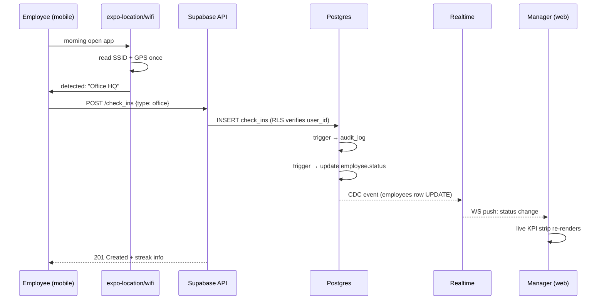
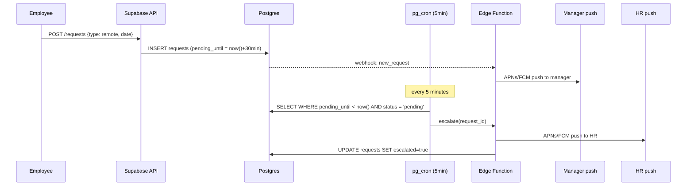
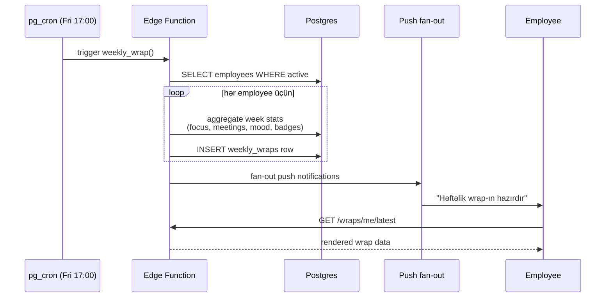
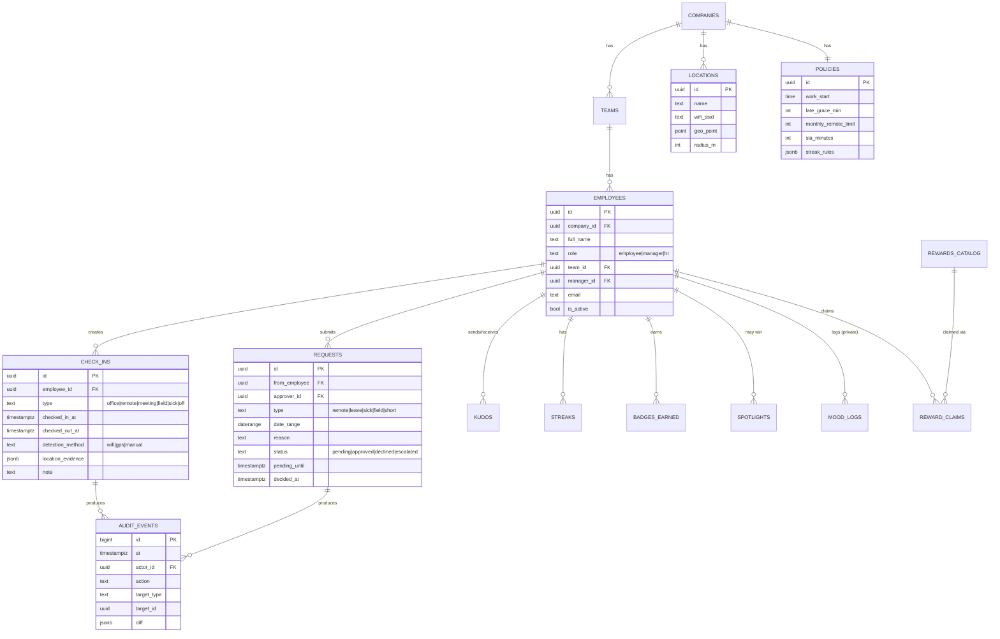
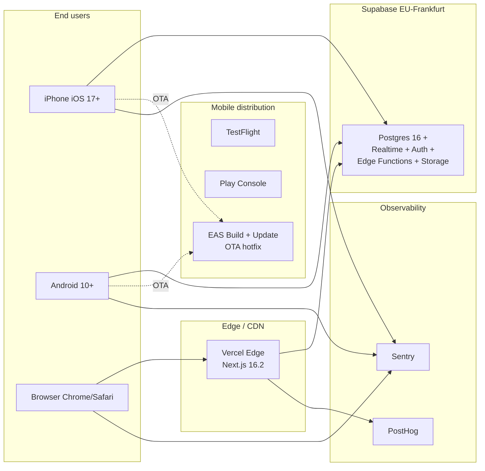
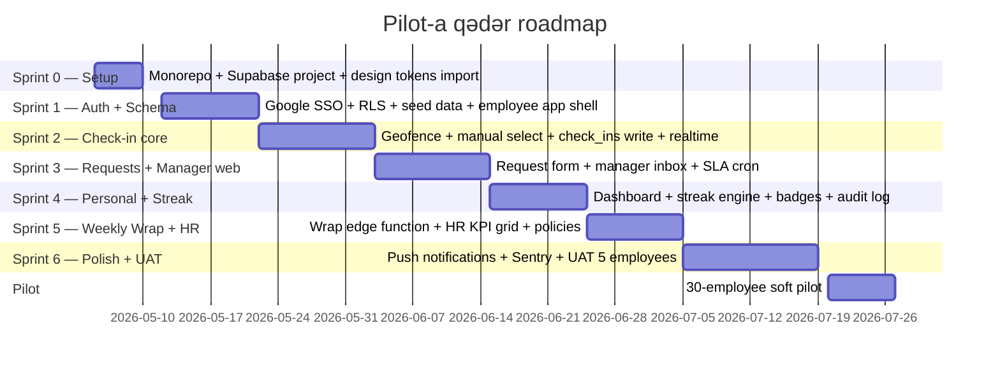

# Employee Attendance — Texniki Arxitektura

> **Sənəd statusu:** v1 (May 2026) · Pilot trajectory: ~9-10 həftə MVP
> **Mənbə spec:** [PROJECT_SPECS.md](./PROJECT_SPECS.md)
> **Design philosophy:** "Cəzalandırma deyil, fərqindəlik."

---

## 0. TL;DR

| Layer | Seçim | Versiya |
|-------|-------|---------|
| Mobile | Expo + React Native (New Architecture) | SDK 55 / RN 0.83 |
| Web | Next.js (App Router, Turbopack, React Compiler) | 16.2 |
| Backend | Supabase (Postgres + Auth + Realtime + Edge Functions) | Postgres 16 |
| Auth | Google Workspace SSO | OAuth via Supabase Auth |
| Hosting | Supabase Cloud (EU-Frankfurt) + Vercel | Managed |
| State | TanStack Query + Zustand | latest |
| Styling | NativeWind v4 (mobile) + Tailwind v4 + shadcn/ui (web) | OKLCH native |
| Monorepo | pnpm + Turborepo | latest |
| Observability | Sentry + PostHog | latest |

**Aylıq xərc proqnozu (100 user):** ~$45 ($25 Supabase Pro + $20 Vercel Pro)

---

## 1. Spec-dən gələn arxitektur konstraintlər

| # | Konstraint | Texniki nəticə |
|---|-----------|----------------|
| 1 | Wi-Fi SSID auto-detect | Native gərək (PWA çıxır). MVP-də GPS-only, SSID v1.5-də. |
| 2 | GPS geofence (80m HQ / 60m branch) | iOS region monitoring (max 20 region — geniş yer var). |
| 3 | Real-time team status | WebSocket. Supabase Realtime (Postgres CDC + Presence). |
| 4 | Push notifications | APNs + FCM via Expo Push Service. |
| 5 | Audit log immutable | Postgres trigger + RLS-də UPDATE/DELETE bağlı. |
| 6 | 30–100 employee | Managed BaaS yetir, öz backend overengineering olardı. |
| 7 | Weekly Wrap (Friday EOD) | `pg_cron` + Edge Function. |
| 8 | Manager 30-min SLA | `pending_until` column + 5dəqiqəlik cron escalation. |
| 9 | Roles: employee / manager / HR | Row-Level Security policies. |
| 10 | Mood check private | Column-level access; aggregation only via materialized view. |

---

## 2. Tövsiyə olunan Tech Stack (May 2026 stabil)

### 2.1 Mobile (employee app)
- **Expo SDK 55** + **React Native 0.83** — New Architecture default (Fabric + TurboModules + Hermes V1)
- **expo-router v4** — file-based navigation
- **expo-location** + **expo-task-manager** — geofencing background, GPS one-time verify
- **react-native-wifi-reborn** + iOS `com.apple.developer.networking.wifi-info` entitlement (v1.5)
- **expo-notifications** — APNs + FCM abstraction
- **NativeWind v4** — Tailwind RN-də (design token-lar HTML mockup-larla 1-1 köçürülür)
- **TanStack Query v5** — server state cache
- **Zustand** — client state
- **react-native-mmkv** — offline cache (sync, sürətli)
- **react-i18next** — AZ + EN scaffolding (gələcək)

### 2.2 Web (manager + HR dashboard)
- **Next.js 16.2** — Turbopack default, React Compiler stable, layout deduplication (sidebar app üçün ideal)
- **React 19**
- **Tailwind CSS v4** — OKLCH native (spec rəngləri birbaşa CSS-ə)
- **shadcn/ui** — accessible primitives, KPI strip + sidebar + inbox üçün
- **Recharts** — KPI strip, team breakdown, mood trend
- **TanStack Query v5** + Supabase client realtime channels
- **next-intl** — AZ default

### 2.3 Backend & Data
- **Supabase managed** (EU-Frankfurt region)
  - **Postgres 16** — primary DB
  - **Auth** — Google Workspace OAuth (domain whitelist)
  - **Realtime** — Postgres CDC + Presence + Broadcast (10k+ concurrent connection limit, sizə geniş yer)
  - **Edge Functions (Deno)** — Weekly Wrap generation, Slack webhook out, push fan-out
  - **Storage** — avatar, kudos image (gələcək)
  - **pg_cron** — weekly wrap, SLA escalation, gecə overtime reminder
  - **PostgREST** — auto-generated CRUD API
  - **RLS policies** — role-based access elə Postgres-də

### 2.4 DevOps / Hosting
- **EAS Build + EAS Update** — TestFlight + Play Internal + OTA hotfix
- **Vercel Pro** — Next.js native, edge functions, preview deployments hər PR-də
- **Sentry** — RN + Web + Edge Functions error tracking
- **PostHog Cloud** — product analytics (kudos send rate, streak retention, request approval median time)
- **GitHub Actions** — CI: lint, typecheck, supabase migration test, RLS policy test

### 2.5 Niyə Supabase, NestJS deyil?

| | Supabase | NestJS + Postgres + Redis + WS |
|---|----------|-------------------------------|
| MVP-ə qədər vaxt | 4-6 həftə | 10-14 həftə |
| Auth + role | Hazır (Google OAuth + RLS) | Manual (Passport, JWT, refresh) |
| Realtime status | Hazır (Postgres Changes + Presence) | Socket.io + Redis pub/sub yazmaq |
| Audit log | RLS + trigger | Eyni, manual |
| 100 nəfər miqyas | İdeal | Overengineering |
| Vendor lock-in | Postgres standartdır, çıxış asan | Yox |
| DevOps yükü | ~0 | High |

**Migration trigger** (öz infra-ya keçmək): 500+ user, və ya kompliance tələbi (data residency AZ).

---

## 3. High-level komponent diaqramı

```mermaid
graph TB
    subgraph "Mobile — Expo SDK 55"
        M_UI[Employee App<br/>RN 0.83 + NativeWind]
        M_LOC[expo-location<br/>geofence + GPS]
        M_WIFI[wifi-reborn<br/>SSID — v1.5]
        M_PUSH[expo-notifications]
        M_CACHE[(MMKV<br/>offline)]
    end

    subgraph "Web — Next.js 16.2"
        W_MGR[Manager Dashboard<br/>Team Live + Inbox + Spotlight]
        W_HR[HR Dashboard<br/>Company KPIs + Policies + Audit]
        W_RSC[React Server Components<br/>+ Server Actions]
    end

    subgraph "Supabase Cloud (EU)"
        SB_AUTH[Auth<br/>Google Workspace SSO]
        SB_API[PostgREST API<br/>auto-generated]
        SB_RT[Realtime engine<br/>WebSocket / CDC]
        SB_DB[(Postgres 16<br/>+ RLS policies)]
        SB_FN[Edge Functions<br/>Deno runtime]
        SB_STO[Storage<br/>avatar, files]
    end

    subgraph "Scheduled & Background"
        CRON[pg_cron<br/>Weekly Wrap · Friday 17:00<br/>SLA escalation · every 5 min]
        TRG[Postgres Triggers<br/>→ audit_log insert]
    end

    subgraph "External"
        APNS[Apple APNs]
        FCM[Google FCM]
        SLACK[Slack/Teams<br/>future]
    end

    M_UI --> SB_AUTH
    M_UI --> SB_API
    M_UI <-->|WSS| SB_RT
    M_LOC --> M_UI
    M_WIFI --> M_UI
    M_PUSH <-- APNS
    M_PUSH <-- FCM
    M_UI --> M_CACHE

    W_MGR --> W_RSC
    W_HR --> W_RSC
    W_RSC --> SB_API
    W_MGR <-->|WSS| SB_RT
    W_HR <-->|WSS| SB_RT

    SB_API --> SB_DB
    SB_RT --> SB_DB
    SB_FN --> SB_DB
    CRON --> SB_DB
    CRON --> SB_FN
    TRG --> SB_DB
    SB_FN --> SLACK
    SB_FN --> APNS
    SB_FN --> FCM

    style M_UI fill:#ffd4c4
    style W_MGR fill:#c4dcff
    style W_HR fill:#c4dcff
    style SB_DB fill:#d4f4d4
```

---

## 4. Data flow nümunələri

### 4.1 Check-in (Wi-Fi/GPS auto-detect → realtime broadcast)



### 4.2 Request approval + SLA escalation



### 4.3 Weekly Wrap generation



---

## 5. Data model



> **Multi-tenancy hazırlığı:** hər cədvəldə `company_id` saxlanılır. RLS policy-ləri `auth.jwt() ->> 'company_id'` ilə hər zaman filtrasiya edir. Single-tenant MVP-də bütün rowları eyni `company_id` ilə seed edirik. v2-də SaaS olanda heç bir migration lazım deyil.

### 5.1 RLS policy nümunələri

```sql
-- Employee yalnız öz check-in-lərini görür və yaza bilər
CREATE POLICY check_ins_self ON check_ins
  FOR ALL USING (auth.uid() = employee_id);

-- Manager öz komandasının check-in-lərini görür (write yox)
CREATE POLICY check_ins_manager_read ON check_ins
  FOR SELECT USING (
    EXISTS (SELECT 1 FROM employees e
            WHERE e.id = check_ins.employee_id
              AND e.manager_id = auth.uid())
  );

-- HR şirkətin hamısını görür
CREATE POLICY check_ins_hr_read ON check_ins
  FOR SELECT USING (
    (auth.jwt() ->> 'role') = 'hr'
    AND (auth.jwt() ->> 'company_id')::uuid =
      (SELECT company_id FROM employees WHERE id = check_ins.employee_id)
  );

-- Mood log: yalnız sahibi görür
CREATE POLICY mood_self_read ON mood_logs
  FOR SELECT USING (auth.uid() = employee_id);
CREATE POLICY mood_no_update ON mood_logs FOR UPDATE USING (false);
CREATE POLICY mood_no_delete ON mood_logs FOR DELETE USING (false);

-- Audit log: HR-only read, no update/delete
CREATE POLICY audit_hr_read ON audit_events
  FOR SELECT USING ((auth.jwt() ->> 'role') = 'hr');
CREATE POLICY audit_no_update ON audit_events FOR UPDATE USING (false);
CREATE POLICY audit_no_delete ON audit_events FOR DELETE USING (false);
```

---

## 6. Deployment topology



---

## 7. Repository strukturu (monorepo)

```
attendance/
├── apps/
│   ├── mobile/              # Expo SDK 55 (employee)
│   │   ├── app/             # expo-router screens
│   │   ├── components/
│   │   ├── lib/
│   │   └── app.config.ts
│   ├── web/                 # Next.js 16 (manager + HR)
│   │   ├── app/             # App Router
│   │   ├── components/
│   │   └── lib/
│   └── functions/           # Supabase Edge Functions (Deno)
│       ├── weekly-wrap/
│       ├── sla-escalate/
│       └── push-fanout/
├── packages/
│   ├── ui/                  # design tokens (OKLCH), shadcn primitives
│   ├── types/               # generated DB types (supabase gen types)
│   ├── domain/              # business logic — saf TypeScript, framework-free
│   │   ├── streak.ts        # streak calc (mobile + web + edge)
│   │   ├── sla.ts           # SLA timer math
│   │   ├── badge.ts         # badge eligibility
│   │   └── rotation.ts      # spotlight fair rotation
│   └── i18n/                # AZ default + EN scaffold
├── supabase/
│   ├── migrations/          # SQL schema versioned
│   ├── seed.sql
│   └── policies/            # RLS rules (testable)
├── .github/workflows/       # CI: lint, typecheck, RLS test, EAS build
├── pnpm-workspace.yaml
└── turbo.json
```

> `packages/domain` kritikdir: streak hesabı, badge unlock, fair rotation — bunların hamısı mobile + web + edge function-larda **eyni** nəticə verməlidir, bir yerdə yazılmalı və hər üç runtime-da işləməlidir (saf TypeScript).

---

## 8. Texniki risklər və mitigation

| Risk | Mitigation |
|------|-----------|
| iOS SSID üçün Apple entitlement gərək | MVP GPS-only, SSID v1.5-də. Apple-a entitlement request 1-3 gün. |
| Background geofence Android Doze mode-da gecikir | Foreground service yox — geofence event-i app açılanda da idempotent catch edirik. |
| Supabase realtime connection limit | 100 user × 2 client = 200, limit 10k. Geniş yer. |
| RLS policy səhvi → data leak | CI-də integration test hər policy üçün; pgTAP test suite. |
| Mood private qalmalı | Materialized view `mood_aggregates_weekly` (employee_id-siz). |
| Late marker (09:15) "punishment-free" | Late event audit-ə düşməsin, yalnız Wrap stat. UI heç vaxt qırmızı yox (spec § 8). |
| AZ-da SMS short code problemləri (sonrakı vers) | MVP Google SSO, SMS əlavə olanda Twilio + AZ operator partner. |
| Vercel + Supabase EU-da latency Bakı-dan | Frankfurt-Bakı ~70ms, normal işləyir. Lazım olsa CloudFront-əlavə. |

---

## 9. MVP roadmap



---

## 10. Açıq qalan iş (spec § 10 + bizim əlavələr)

| # | Item | Status | Priority |
|---|------|--------|----------|
| 1 | Check-out UI flow | spec-də designed (Hybrid) | HIGH |
| 2 | Request decision notification UI | spec-də draft | HIGH |
| 3 | Kudos received view | spec-də draft | MEDIUM |
| 4 | Reward redemption flow | spec-də draft | MEDIUM |
| 5 | HR request audit detail screen | spec-də draft | MEDIUM |
| 6 | Empty state / first day | spec-də open | LOW |
| 7 | Error / edge states (GPS off, wrong office) | spec-də open | LOW |
| 8 | Calendar inteqrasiyası (Google → focus block) | spec-də Phase 2 | DEFERRED |
| 9 | Slack/Teams kudos webhook | spec-də Phase 2 | DEFERRED |
| 10 | AZ → EN i18n switch | bizim əlavə | DEFERRED |

---

## 11. Növbəti addım

→ [docs/sprint-0-tasks.md](./docs/sprint-0-tasks.md) — Sprint 0 konkret task siyahısı
